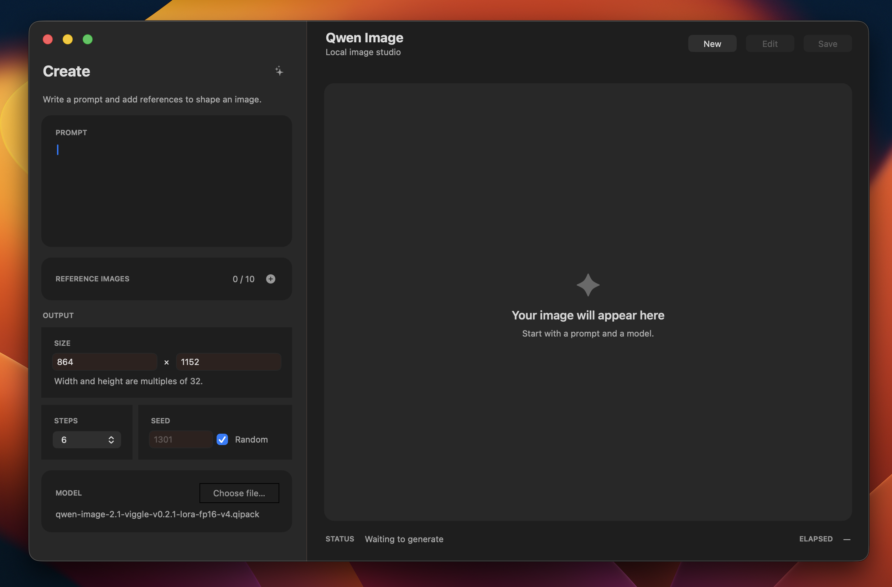

# qwen-image-cplus — FP16 1024×1024 in 38–39 s (M1 Max, 4 steps)

The headline result is a **fresh-process, prompt-to-PNG** run of the four-step
Viggle model, with both quoted poster lines rendered exactly. Its transformer
block matrices are stored in FP16 QIPACK, not 4-bit weights. The native C+ and
Metal runtime also supports the original 40-step Qwen-Image-2.1 model and
image editing with up to ten references.

| Measured M1 Max run | End to end |
| --- | ---: |
| [Four-step Viggle FP16](benchmarks/m1-max-viggle-4step-1024-fixed-cost.json), 1024×1024 poster | **38.18–39.32 s** |
| Six-step Viggle v0.2.1 FP16 + LoRA, 1024×1024 text-to-image smoke | **75.974 s** |
| [Base FP16](benchmarks/m1-max-native-prompt-pipeline-1024.json), 1024×1024, 40 steps, cache off | **451.12 s** |
| Base FP16, later optimized build with Cache-DiT 0.16, 27 of 40 steps cached | **126.69 s** |

These are recorded end-to-end runs on one 32 GB M1 Max, with different prompts
and dates—not a controlled comparison between the rows. In a separate
1024×1024/40-step cache-off speed baseline,
[patched stable-diffusion.cpp](benchmarks/m1-max-stable-diffusion-cpp-1024-40.json)
took **1006.36 s**; its selected flow shift differed, so that is not an
image-equivalence claim. FP16 describes the transformer weights, not every
component of the pipeline. The four-step pack is fast but can deform some
edits; the six-step LoRA is an alternative for those cases. See the
[performance record](docs/performance.md#remaining-optimization-phases) for conditions and caveats.

Generation is local, without cloud inference or a Python runtime. One Homebrew
install provides a desktop app, CLI, and C library. Model weights are
downloaded separately.



## Linux CUDA numbers

Hardware: NVIDIA RTX 2060 (6 GB, sm_75), PCIe gen3 x8, Linux, CUDA 12.6.
Model: Viggle Qwen-Image-2.1 turbo v0.1, 4 steps, seed 1301.
GGUF: Diffusers 80c7ed2 + Torch 2.14 with the Q4_K_M GGUF transformer.
Ours: C+ / CUDA engine with the W4A4 (H256, g64, clip, v6) or W4A16 (g64, v6) QIPACK.

| Task | Size | GGUF Q4_K_M | Ours W4A4 | Ours W4A16 |
| --- | --- | ---: | ---: | ---: |
| Text to image | 512×512 | ~39–45 s | ~7.2 s | ~10.9 s |
| Text to image | 1024×1024 | ~74.5 s | ~17.4 s | ~30.8 s |
| Image edit (1 image) | 512×512 | ~76.3 s | ~8.7 s | ~13.6 s |
| Image edit (1 image) | 1024×1024 | ~101.5 s | ~24.8 s | ~41.8 s |
| Image edit (2 images) | 512×512 | ~74.9 s | ~10.0 s | ~15.5 s |

The pack picks the mode: W4A4 is faster, W4A16 stays closer to FP16.

End to end, fresh process, warm file cache. GGUF edits at 1024 and with two
images run out of memory with model offload and use group offload. Details in
[nums.md](nums.md).

## Install

Requires macOS 14 or newer on Apple Silicon. Homebrew installs prebuilt
binaries; users do not need the C+ compiler. This project and its formula live
in one repository. With Homebrew 7, trust only this formula when prompted:

```sh
brew tap netdur/qwen_image_metal_dev https://github.com/netdur/qwen-image-cplus.git
brew trust --formula netdur/qwen-image-cplus/qwen-image-cplus
brew install netdur/qwen-image-cplus/qwen-image-cplus
```

The installation contains:

```text
bin/qwen-image-cplus
bin/qwen-image-gui
Qwen Image.app
include/qwen_image.h
lib/libqwen_image.a
lib/libqwen_image.dylib
```

## Model files

Model weights are intentionally not part of the Homebrew archive. The runtime
expects a QIPACK transformer and its Qwen-Image-2.1 support files at paths
supplied to the CLI or library request. Keeping models separate makes
application upgrades small and lets applications manage their own model storage.

The QIPACK files are published at
[`netdur/Qwen-Image-2.1-QIPACK`](https://huggingface.co/netdur/Qwen-Image-2.1-QIPACK).
Their model card, Qwen license, required attribution, and artifact manifest
live in [`huggingface/`](huggingface/README.md) so the published metadata stays
versioned with the runtime.

For the six-step pack used below, download only that pack, its LoRA, and the
shared support files into one folder:

```sh
hf download netdur/Qwen-Image-2.1-QIPACK \
  qwen-image-2.1-viggle-v0.2.1-lora-fp16-v4.qipack \
  Qwen-Image-2.1-viggle-turbo-v0.2.1-6step-lora-r256.safetensors \
  processor/vocab.json processor/merges.txt \
  text_encoder/model-00001-of-00004.safetensors \
  text_encoder/model-00002-of-00004.safetensors \
  text_encoder/model-00003-of-00004.safetensors \
  text_encoder/model-00004-of-00004.safetensors \
  vae/diffusion_pytorch_model.safetensors \
  --local-dir models
```

This still needs roughly 34.5 GB of disk space. Omit the LoRA and choose one
of the other QIPACK files if you prefer the base or four-step model; see the
[model card](https://huggingface.co/netdur/Qwen-Image-2.1-QIPACK) for their
names and defaults.

Keep the supporting files alongside the pack in this layout; multiple packs
can share the same supporting files:

```text
models/
  chosen-model.qipack
  Qwen-Image-2.1-viggle-turbo-v0.2.1-6step-lora-r256.safetensors
  processor/vocab.json
  processor/merges.txt
  text_encoder/model-00001-of-00004.safetensors
  text_encoder/model-00002-of-00004.safetensors
  text_encoder/model-00003-of-00004.safetensors
  text_encoder/model-00004-of-00004.safetensors
  vae/diffusion_pytorch_model.safetensors
```

The LoRA file is needed only for the six-step pack. The CLI and C/C+ APIs take
the QIPACK path and model root separately; they may point to the same
directory. The local `models/` directory is ignored by Git.

## Run the app

```sh
qwen-image-gui
```

Alternatively, launch the bundled app through Finder or with
`open "$(brew --prefix qwen-image-cplus)/Qwen Image.app"`. Choose a QIPACK
from the downloaded model folder, enter a prompt, optionally add reference
images, set the output size, then click the sparkle beside **Create**. The
finished image appears on the right; **Save** opens a PNG save dialog. The
selected model's folder supplies the text encoder, processor, and VAE files.

## Use the CLI

Generate a 512x512 PNG from text:

```sh
qwen-image-cplus generate \
  models/qwen-image-2.1-viggle-v0.2.1-lora-fp16-v4.qipack \
  models output.png "A red balloon against a blue sky" 512 512 1301
```

The arguments after `generate` are QIPACK path, model folder, output PNG,
prompt, width, height, and optional seed. This pack selects its own six-step
schedule. To edit one or more images, use:

```sh
qwen-image-cplus generate-multi-image-sized \
  models/qwen-image-2.1-viggle-v0.2.1-lora-fp16-v4.qipack \
  models edited.png "Make it rain" 1301 pack 512 512 input.jpg
```

Here `pack` selects the model's step count; the next two numbers are output
width and height. Add up to ten reference-image paths after them. Run these
commands in the directory containing `models/`, or use absolute paths.

## Use the library

The installed header and static/dynamic libraries expose a synchronous C ABI.
See [API usage](docs/API.md) for a compiling C example, linking instructions,
request fields, status handling, and the native C+ API. The GUI and CLI share
the same inference engine.

The runtime is intentionally model-specific. It does not embed Python,
PyTorch, or Diffusers. A separate Python development tool may generate small
oracle fixtures from the pinned official Diffusers source; those fixtures are
plain binary files consumed by C+ tests.

## Documentation

- [Model behavior and validation](docs/model-behavior.md): resolutions, schedules, and image conditioning.
- [Library API](docs/API.md): C/C+ examples and request contract.
- [Package architecture](docs/architecture.md): portable core, backends, clients, and C ABI.
- [Build and verify](docs/build-and-verify.md): distribution and development checks.
- [Engine foundation](docs/engine-foundation.md): correctness gates and the first native pipeline.
- [Metal optimization history](docs/metal-optimization-history.md): kernel and I/O decisions.
- [1024 validation](docs/1024-validation.md): full-resolution oracles and measured changes.
- [Performance record](docs/performance.md): timings, optimization work, and the six-step LoRA.
- [Quantization decisions](docs/quantization.md): measured precision tradeoffs.
- [Native GUI](docs/gui.md): component structure and background worker.
